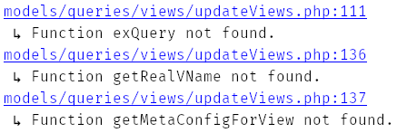

# PHPStan one-line error formatter

[](https://packagist.org/packages/grifart/phpstan-oneline)
[](https://packagist.org/packages/grifart/phpstan-oneline)
[](https://packagist.org/packages/grifart/phpstan-oneline)
[](https://travis-ci.org/grifart/phpstan-oneline)

Compact and **clickable** [PhpStan](http://github.com/phpstan/phpstan) error output handler.

So when you run for example:

```bash
phpstan analyze -l max --configuration phpstan.neon --error-format oneline
```


and now you will get to the location where error occurred by one-click!

## Installation

```bash
composer require --dev grifart/phpstan-oneline
```

and register error formatter into your `phpstan.neon`:

```neon
includes:
	- vendor/grifart/phpstan-oneline/config.neon
```

### Clickable paths in PhpStorm

1. Install [Awesome Console](https://github.com/anthraxx/intellij-awesome-console) (available in PhpStorm repositories)
2. run phpstan in PhpStorm terminal


## Custom error format

There has been added `compact` error format. It looks like this by default:

```bash
phpstan analyze -l max --configuration phpstan.neon --error-format compact
```



You can customize `compact` error format in your `phpstan.neon`:

```neon
parameters:
	compact:
		format: "{path}:{line}\n ↳ {error}" # default
```

